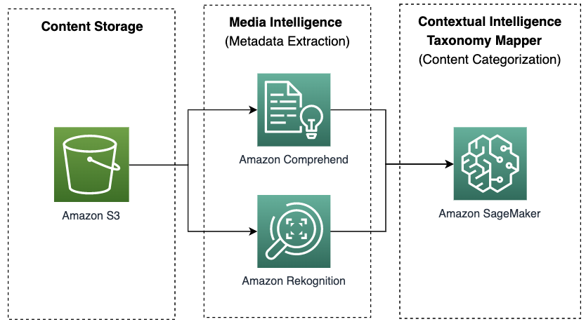
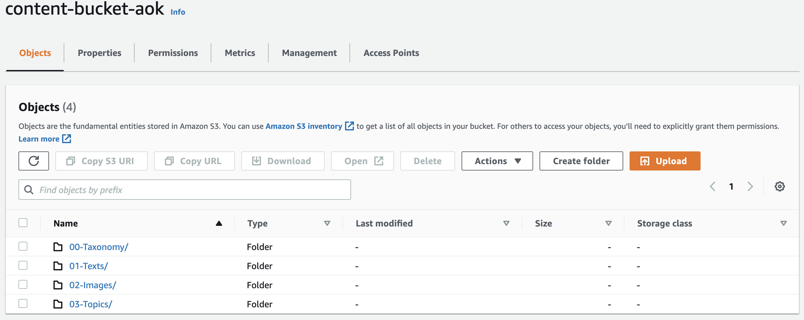
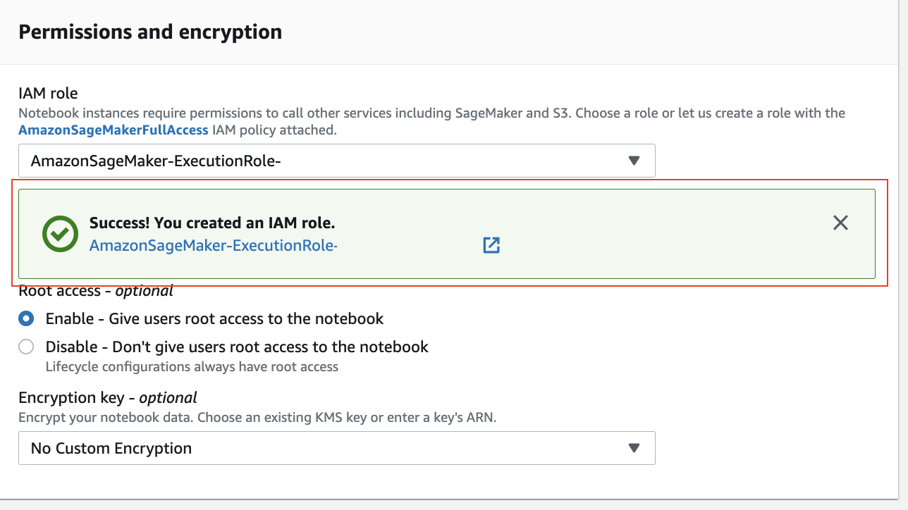
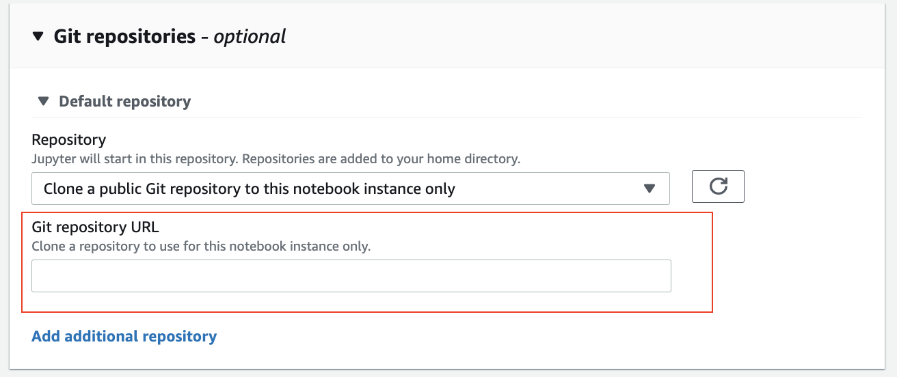
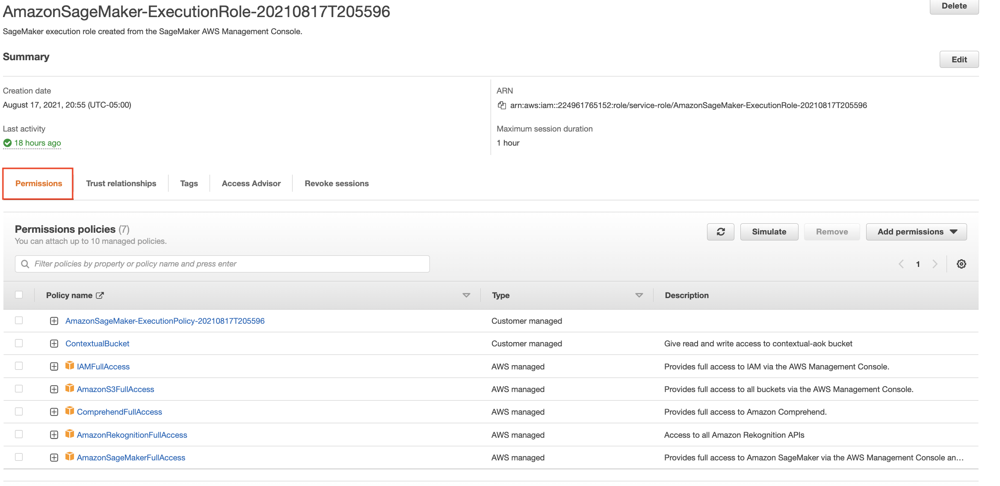
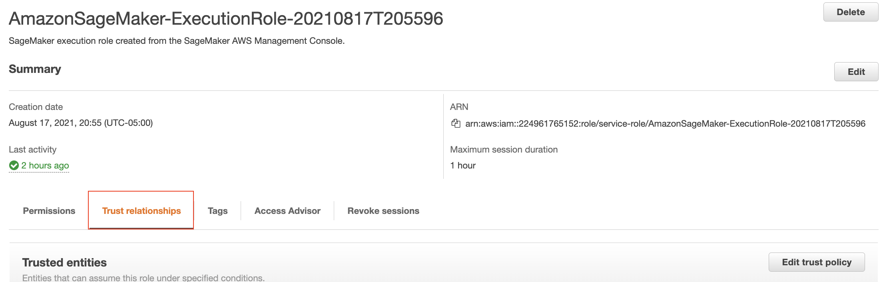

# **Contextual Intelligence Taxonomy Mapper**


## Introduction
The Contextual Intelligence Taxonomy Mapper (CITM) provides a machine learning framework to extract context from digital content and map it to an industry standard content taxonomy in order to generate value. CITM can help accelerate development of a cookie-less ad targeting solution that is based on contextual insights from digital content. 

The underlying code for CITM is presented here as an Amazon SageMaker notebook that you can run and test in your environment with sample data of your choice. The notebook will allow you to analyze text and images from webpage content and map its granular metadata to a content taxonomy.

You can use CITM and extend it to other industry scenarios. For example, education technology companies can use it to map their content to industry taxonomies.

For a technical deep dive on Contextual Intelligence Taxonomy Mapper, read the supplemental AWS Machine Learning blog.

## **Solution Overview**

This framework comprises two components: Media Intelligence capabilities for context extraction from content on web pages, and Contextual Intelligence Taxonomy Mapper for intelligent mapping of content to an industry taxonomy

**Media Intelligence**
Media Intelligence solutions are integrated machine learning technologies that automatically extract contextual metadata from online content at scale. This framework integrates Amazon Comprehend and Amazon Rekognition to extract contextual metadata from webpage text and images.

**Contextual Intelligence Taxonomy Mapper (CITM)**
CITM is powered by a  BERT sentence transformer accessed from Hugging Face. Its goal is to map granular contextual metadata (generated by Amazon Comprehend and Amazon Rekognition) to semantically related keywords on the content taxonomy.


## **Architecture Overview**




CITM was developed and tested using the [IAB Tech Lab Content Taxonomy](https://iabtechlab.com/standards/content-taxonomy/). You can use this code with another content taxonomy of your choice. Note that you will need to modify elements of CITM’s code to accommodate your chosen taxonomy’s data structure

## **Implementation**

This framework will analyze extracted text and images from webpages. Before implementation, ensure you have extracted sample texts and images and stored them on AWS (via Amazon S3).

### **Pre-requisites**

1. **AWS account**
2. **Amazon S3 bucket** with the recommended folder structure below. You can name these folders as desired:
    1. Taxonomy: A folder where you store your chosen content taxonomy
    2. Texts: A folder where you store all extracted text content as text files
    3. Images: A folder where you store all extracted images
    4. Topics: A folder where you store topic detection output from Amazon Comprehend

    *Below is a snapshot of a sample Amazon S3 bucket structure:*
    

          

    Recommendation: If you are analyzing text and image content from web pages, store your content in such a way that you can accurately associate each image with the text it was associated to on the webpage. For example, if text extracted from a webpage is stored as ’a-walk-in-the-park.txt,’ store all images from that webpage as ‘a-walk-in-the-park_00.jpg,’ ‘a-walk-in-the-park_01.jpg,’ etc. 


3. **Amazon SageMaker notebook instance** with the following selections:
    1. Platform Identifier: Select Amazon Linux 2, Jupiter Lab 1
    2. IAM Role: Create a new SageMaker Execution role with full access to the bucket where you are storing your content. Once created, take note of the name of this role

    
    3. Git repositories: In the drop down **Repository** menu, select *‘Clone a public Git repository to this notebook instance only’* and paste the URL for this repository
    
     
    For help on how to create a SageMaker notebook instance, click [here](https://docs.aws.amazon.com/sagemaker/latest/dg/gs-setup-working-env.html.). The recommended kernel to run the code is conda_pytorch_p38


4. **Additional IAM settings.** The SageMaker Execution role attached to your notebook instance will need additional permissions.  Navigate to ‘Identity and Access Management (IAM)’ and follow these steps:
    1. Select **Roles** from the left menu bar and locate your SageMaker Execution role
    2. Ensure the following permission policies are attached to your SageMaker Execution role
        1. AmazonS3FullAccess: Add this permission if you will be testing CITM code on content that is stored in multiple Amazon S3 buckets
        2. AmazonRekognitionFullAccess
        3. ComprehendFullAccess
        4. AmazonSageMakerFullAccess
        5. IAMFullAccess

        
    3. Configure the trust policy of the SageMaker execution role to allow Amazon Comprehend to assume its role for topic modeling
        1. In the same window, select **Trust relationships** and click on **Edit trust policy**
         

        2. Edit the existing policy by adding a statement for the Amazon Comprehend trust policy as seen here below (change the account id and region as needed). Refer to [Amazon Comprehend IAM documentation](https://docs.aws.amazon.com/comprehend/latest/dg/access-control-managing-permissions.html#auth-role-permissions)for more details.

```
{
  "Version": "2012-10-17",
  "Statement": [
    {
      "Effect": "Allow",
      "Principal": {
        "Service": "comprehend.amazonaws.com"
      },
      "Action": "sts:AssumeRole",
      "Condition": {
          "StringEquals": {
              "aws:SourceAccount": "111122223333"
          },
          "ArnEquals": {
              "aws:SourceArn": "arn:aws:comprehend:us-west-2:111122223333:topics-detection-job/*"
          }
      }
    }
  ]
}
```


## Security

See [CONTRIBUTING](CONTRIBUTING.md#security-issue-notifications) for more information.

## License

This project is licensed under the Apache-2.0 License.


